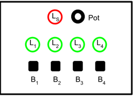

# Assignment 1 - RestoreTheLights

First assignment developed on Arduino using Arduino IDE of [Embedded Systems and IoT - a.y. 2023-2024](https://www.unibo.it/en/teaching/course-unit-catalogue/course-unit/2023/400396) ([Computer Science and Engeneering](https://corsi.unibo.it/1cycle/ComputerScienceEngineering)).

## Author

[@EnryMarch10](https://github.com/EnryMarch10)

## Behavior

The game board is based on four green leds L1, L2, L3, L4 and a red led LS, four tactile buttons B1, B2, B3, B4 and a potentiometer Pot, displaced in the following layout:

    

During a game, the leds L1…L4 are initially all on. Then, after some random time T1, the leds start turning off, one by one in sequence, in some random order, taking some  T2 time. As soon as the last led is turned off, the player must turn on the leds in the reverse order by pressing the corresponding buttons B1…B4, within some time T3. Each button Bi turns on the corresponding led Li. So if the order in which the leds were turned off was for instance 3,1,2,4 (that is: the first led to be turned off was L3, then L1, etc), then the leds must be turned on again in order 4,2,1,3 (that is: first L4, then L2, etc). If the player restores the leds on time, the score - starting from zero - is increased and the game goes on, repeating the sequence, but reducing the times T2 and T3 of some factor F. If the player does not restore the leds on time in the correct order, the red led Ls is turned on for 1 second and the game ends, displaying the score on the serial line. 

### Game detailed behavior  

In the initial state, all green leds are off but led LS that pulses (fading in and out), waiting for some player to start the game. On the serial line, it must be sent the message “Welcome to the Restore the Light Game. Press Key B1 to Start”. 

If/When the button B1 is pressed the game starts. If the B1 button is not pressed within 10 seconds, the system must go into deep sleeping. The system can be awoken back by pressing any button. Once awoken, the system goes in the initial state and the led Ls starts pulsing again. When the game starts, all leds are switched off and a “Go!” message is sent on the serial line. An initial score is set to zero.

During the game:
- the leds L1…L4 are turned on some random time T1;
- then, the leds are then turned off one by one in some random order, taking T2 time;
- the player has max T3 time for restoring the leds in the inverse order, by pressing the buttons B1…B4 (each button Bi turns on the corresponding led Li);
- If the player restores the lights on time and in the correct (inverse) order, then:
  -	the score is increased and a message "New point! Score: XXX" (where XXX is the current score) is sent on the serial line;
  -	the game goes on, by reducing the times T2 and T3 of some factor F;
- If the player does not restore the lights on time in the correct order, then the red led Ls turned on for 1 second and the game ends: a message "Game Over. Final Score: XXX" (where XXX is the final score) is sent on the serial line for 10 seconds, then the game restarts from the initial state.

Before starting the game, the potentiometer Pot device can be used to set the difficulty L level  which could be a value in the range 1..4 (1 easiest, 4 most difficult). The level must affect the value of the factor F (so that the more difficult the game is, the greater the factor F must be). 

## License

[MIT](https://choosealicense.com/licenses/mit/)
